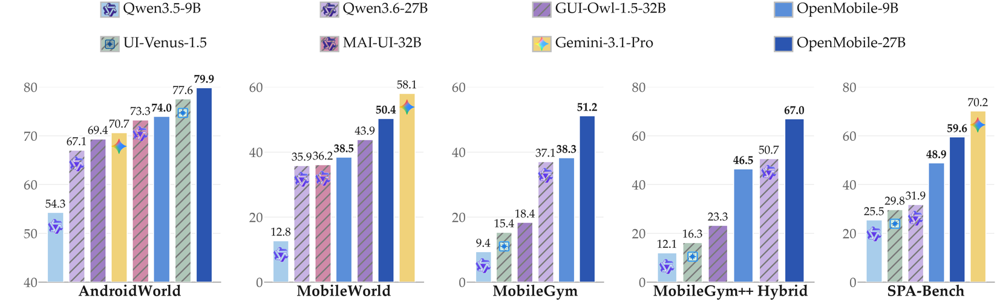

# OpenMobile-2: Building Versatile Mobile Agents with Scalable Environments and App-Native Tools

<p align="center">
&nbsp;&nbsp;📑 <a href="<PAPER_URL>">Paper</a>&nbsp;&nbsp; | &nbsp;&nbsp;🌐 <a href="https://os-copilot.github.io/OpenMobile2-Home">Homepage</a>&nbsp;&nbsp; | &nbsp;&nbsp;🤗 <a href="https://huggingface.co/datasets/OpenMobile-2/OpenMobile-Data-v2">Dataset</a>&nbsp;&nbsp; | &nbsp;&nbsp;🤖 <a href="https://huggingface.co/OpenMobile-2/OpenMobile-2-27B">Model</a>&nbsp;&nbsp; | &nbsp;&nbsp; <a href="https://github.com/OpenMobile2/MobileGym-plusplus">MobileGym++</a>&nbsp;&nbsp;
</p>

We introduce OpenMobile-2, a near-frontier mobile agent with fully open training environments and recipes. We make three key advances: (1) *Diverse environments with simulated commercial apps*: We build **MobileGym++**, featuring 35 realistic, functionally rich commercial-style apps with cross-app workflows, while preserving full controllability for reset and verification. Together with newly configured apps in Android emulators, this yields a diverse playground spanning over 110 apps. (2) *Open training data at scale*: Building on this foundation, we curate nearly 12K mobile interaction trajectories for supervised fine-tuning and the largest open collection of verifiable RL training data for mobile agents, comprising over 2K executable tasks with automatic rewards. (3) *Hybrid GUI and app-native tool use*: We explore an experimental mobile-use setting where apps expose selected functionalities as app-native tools alongside their GUIs, allowing agents to interleave GUI actions and tool calls within a task. We implement this setting in **MobileGym++** with over 300 carefully scoped tools across 50+ apps. Additionally, we introduce **MobileGym++ Bench** for complex, long-horizon commercial mobile scenarios, supporting both GUI-only and hybrid GUI–tool evaluation on a shared task suite.

OpenMobile-2 performs competitively across established benchmarks, including AndroidWorld (79.9) and MobileWorld (50.4), while showing promising transfer to real-device mobile use, nearly doubling SPA-Bench performance from 31.9 to 59.6.

<p align="center">
  
</p>

Release plans:

- [x] [OpenMobile-Data-v2](https://huggingface.co/datasets/OpenMobile-2/OpenMobile-Data-v2)
- [x] [Fine-tuned checkpoints](https://huggingface.co/OpenMobile-2/OpenMobile-2-27B) trained on [OpenMobile-Data-v2](https://huggingface.co/datasets/OpenMobile-2/OpenMobile-Data-v2)
- [x] [MobileGym++ environment and benchmark](https://github.com/OpenMobile2/MobileGym-plusplus)
- [x] Evaluation code
- [x] [Extended Android AVDs](https://huggingface.co/datasets/yanhhh/AndroidAvd)
- [ ] Data construction scripts
- [ ] Other code and resources

## 📋 Contents

- [Environment setup](#environment-setup)
- [Evaluation](#evaluation)
  - [Runtimes](#runtimes)
  - [AndroidWorld](#androidworld)
  - [MobileGym](#mobilegym)
  - [MobileWorld](#mobileworld)
  - [MobileGym++ Bench](#mobilegym-bench)
- [Training](#training)
- [Acknowledgements](#acknowledgements)
- [License](#license)

<a id="environment-setup"></a>
## ⚙️ Environment setup

Install one Python environment, `android_world`, and use it for every eval in this repository. Details, including the protobuf pin, are in [`AndroidWorld/environment.md`](AndroidWorld/environment.md).

```bash
conda create -n android_world python=3.11.8
conda activate android_world
cd <OPENMOBILE_ROOT>/AndroidWorld
python -m pip install -r requirements.txt
conda install -c conda-forge opencv
python setup.py install
python -m pip install -e android_env
python -m pip install openai pillow tqdm ImageHash sentence-transformers
python -m pip install -U "protobuf==7.35.1" "grpcio==1.84.0" "grpcio-status==1.84.0"
```

This repository evaluates the agent. Each device, frontend, or emulator is started from its own repository. The commands are in [Evaluation](#evaluation).

| Benchmark | Start the environment | Score it here |
|---|---|---|
| AndroidWorld | [AndroidWorld](https://github.com/google-research/android_world) | [`run.py`](#androidworld) |
| MobileGym | [mobilegym](https://github.com/Purewhiter/mobilegym) | [`run_eval_session.ps1`](#mobilegym) |
| MobileWorld | [MobileWorld](https://github.com/Tongyi-MAI/MobileWorld) | [`parallel_eval_mw.py`](#mobileworld) |
| MobileGym++ | [MobileGym-plusplus](https://github.com/OpenMobile2/MobileGym-plusplus) | [`eval_bench215.ps1`](#mobilegym-bench) |

<a id="evaluation"></a>
## 📊 Evaluation

Download the target model and deploy it with [vLLM](https://github.com/vllm-project/vllm) (for example, OpenMobile-2-9B). The server address and the served model name are the `model_base_url` and `model_name` used in the commands below. Local servers can use `EMPTY` as the API key.

Start the environment from the repository named in the table above, then run the command in that benchmark's section.

<a id="runtimes"></a>
### 🤗 Runtimes

OpenMobile-2 is evaluated with `qwen35_thought_session`. `qwen3vl` is the flat ReAct runtime for OpenMobile-8B. `venus` and `gui_owl` reproduce UI-Venus-1.5 and GUI-Owl.

| `--runtime` | What the model sees | Typical `last_n` |
|---|---|---|
| `qwen3vl` | One system prompt and one user prompt. Past `Action:` lines are concatenated into that user prompt, with the last N screenshots. Output is Thought, Action, and one JSON `<tool_call>`. | 1 |
| `qwen35_thought_session` | Multi-turn session used for the evaluations below. The task is sent once. Later turns are screenshots. The assistant writes `Thought:` and then one XML `<tool_call>`. Native thinking is off. | 3 |
| `venus` | Current screenshot only. Output is `<think>`, `<action>`, `<conclusion>`. | ignored |
| `gui_owl` | MobileGym / MobileGym++ official GUI-Owl adapter. The prompt stays in that benchmark. | benchmark default |


`gui_owl` is not implemented inside `runtimes/`. Pass it as the benchmark agent name.

<a id="androidworld"></a>
### AndroidWorld

Python environment: [`AndroidWorld/environment.md`](AndroidWorld/environment.md). The AVD itself follows the [AndroidWorld](https://github.com/google-research/android_world) instructions. Leave the emulator running while the eval is in progress. Console port `5554` and gRPC port `8554` must match the eval flags below.

#### 1. Start the AndroidWorld emulator / ADB environment

On macOS the emulator binary is `~/Library/Android/sdk/emulator/emulator`.

```bash
EMULATOR_NAME=AndroidWorldAvd
~/Library/Android/sdk/emulator/emulator -avd $EMULATOR_NAME -port 5554 -no-snapshot -grpc 8554
```

#### 2. Run evaluation

`--perform_emulator_setup=true` is required once on a fresh AVD. After that, drop the flag.

```bash
cd AndroidWorld
python run.py \
  --runtime qwen35_thought_session \
  --last_n 3 \
  --console_port 5554 \
  --grpc_port 8554 \
  --perform_emulator_setup=true \
  --model_base_url http://<openai-compatible-host>/v1 \
  --model_api_key EMPTY \
  --model_name YOUR_MODEL \
  --checkpoint_dir runs/androidworld-thought \
  --task_random_seed 30
```

OpenMobile-8B uses the flat ReAct runtime:

```bash
python run.py \
  --runtime qwen3vl \
  --last_n 1 \
  --console_port 5554 \
  --grpc_port 8554 \
  --model_base_url http://<openai-compatible-host>/v1 \
  --model_api_key EMPTY \
  --model_name OpenMobile-8B \
  --checkpoint_dir runs/androidworld-qwen3vl
```

Results are written under `--checkpoint_dir`.

<a id="mobilegym"></a>
### MobileGym

Start the phone from [mobilegym](https://github.com/Purewhiter/mobilegym). The eval below talks to the URL you start.

#### 1. Start the MobileGym frontend

`<MOBILEGYM_FRONTEND>` is the checkout that contains `package.json` and `bench_env`. In the official repo that is the inner `mobilegym/` directory.

```bash
cd <MOBILEGYM_FRONTEND>
npm run preview -- --host 127.0.0.1 --port 4172
```

#### 2. Run evaluation

Pass that same directory as `-FrontendDir`. `-EnvUrl` and `-Port` must match the preview above.

```powershell
cd <OPENMOBILE_ROOT>\MobileGym
.\run_eval_session.ps1 -Runtime qwen35_thought_session -ModelName YOUR_MODEL `
  -FrontendDir <MOBILEGYM_FRONTEND> `
  -ModelBaseUrl http://<openai-compatible-host>/v1 -EnvUrl http://127.0.0.1:4172 -Port 4172
.\run_eval_session.ps1 -Runtime qwen3vl -ModelName OpenMobile-8B `
  -FrontendDir <MOBILEGYM_FRONTEND> `
  -ModelBaseUrl http://<openai-compatible-host>/v1
.\run_eval_session.ps1 -Runtime venus -ModelName UI-Venus-1.5-8B `
  -FrontendDir <MOBILEGYM_FRONTEND> `
  -ModelBaseUrl http://<openai-compatible-host>/v1
.\run_eval_session.ps1 -Runtime gui_owl -ModelName GUI-Owl-1.5-8B `
  -FrontendDir <MOBILEGYM_FRONTEND> `
  -ModelBaseUrl http://<openai-compatible-host>/v1
```

`-Runtime` is `qwen35_thought_session` (default, last_n 3), `qwen3vl` (last_n 1), `venus` (last_n 1), or `gui_owl`. `qwen35_session` is still accepted. Output is `MobileGym/runs_main/<ModelName>` with dots removed.

<a id="mobileworld"></a>
### MobileWorld

Start the backends from [MobileWorld](https://github.com/Tongyi-MAI/MobileWorld). [`MobileWorld/README.md`](MobileWorld/README.md) repeats that start command. GUI tasks and MCP tasks are separate runs. Do not put both on the same hosts at the same time.

#### 1. Start the MobileWorld backends

`--count 2` serves `http://127.0.0.1:6800` and `http://127.0.0.1:6801`.

```bash
cd <PARENT>/MobileWorld
uv run mw env run --count 2
```

#### 2. Run evaluation

`--hosts` must be the backends started above.

GUI tasks:

```powershell
cd <OPENMOBILE_ROOT>\MobileWorld
python parallel_eval_mw.py `
  --hosts http://127.0.0.1:6800,http://127.0.0.1:6801 `
  --runtime qwen35_thought_session `
  --last_n 3 `
  --tasks ALL `
  --output_dir eval-gui/YOUR_MODEL/gui-only `
  --model_base_url http://<openai-compatible-host>/v1 `
  --model_name YOUR_MODEL `
  --model_api_key EMPTY
```

MCP tasks use the same runtime and add `--mcp_only`. Run this only after the GUI run has released those hosts, or point it at a different pair:

```powershell
python parallel_eval_mw.py `
  --hosts http://127.0.0.1:6800,http://127.0.0.1:6801 `
  --runtime qwen35_thought_session `
  --last_n 3 `
  --mcp_only `
  --enable_user_interaction `
  --output_dir eval-mcp/YOUR_MODEL `
  --model_base_url http://<openai-compatible-host>/v1 `
  --model_name YOUR_MODEL `
  --model_api_key EMPTY
```

Summaries are `eval_summary.json` inside each output directory. Flat OpenMobile-8B is `--runtime qwen3vl --last_n 1` on the GUI run (MCP expects a session runtime).

<a id="mobilegym-bench"></a>
### MobileGym++ Bench

Start the phone from [MobileGym-plusplus](https://github.com/OpenMobile2/MobileGym-plusplus). Use a different port from official MobileGym (`4172`).

`<MOBILEGYM_PP>` is that checkout. It contains `package.json` and `bench_env`.

#### 1. Start the MobileGym++ mock frontend

```powershell
cd <MOBILEGYM_PP>
npm run preview -- --host 127.0.0.1 --port 3000
```

#### 2. Run evaluation

Pass that same directory as `-FrontendDir`. `-Port` must match the preview above.

```powershell
cd <OPENMOBILE_ROOT>\MobileGymPP
.\eval_bench215.ps1 -Runtime qwen35_thought_session -Port 3000 -Mode both `
  -FrontendDir <MOBILEGYM_PP> `
  -ModelBaseUrl http://<openai-compatible-host>/v1 -ModelName YOUR_MODEL
.\eval_bench215.ps1 -Runtime qwen3vl -Mode gui_only -Port 3000 `
  -FrontendDir <MOBILEGYM_PP> `
  -ModelBaseUrl http://<openai-compatible-host>/v1 -ModelName OpenMobile-8B
.\eval_bench215.ps1 -Runtime venus -Port 3000 `
  -FrontendDir <MOBILEGYM_PP> `
  -ModelBaseUrl http://<openai-compatible-host>/v1 -ModelName UI-Venus-1.5-8B
```

`-Runtime` is `qwen35_thought_session`, `qwen3vl`, `venus`, `gui_owl`, or `mai_ui`. `-Mode gui_only` or `-Mode hybrid` runs one side. Output is `MobileGymPP/eval_runs/<ModelName>/bench215-mock/` with `gui_only` and `hybrid` subdirectories. Pass `-OutputDir` to write somewhere else.

<a id="training"></a>
## 🎯 Training

We fine-tune OpenMobile-2 models with [ms-swift](https://github.com/modelscope/ms-swift). The SFT data is released as [OpenMobile-2/OpenMobile-Data-v2](https://huggingface.co/datasets/OpenMobile-2/OpenMobile-Data-v2).

The public training files are `emulator/train.json`, `simulator/gui-only/train.json`, and `simulator/hybrid/train.json`. `dataset_info.json` registers them as `emulator_qwen35_last3_noloop_notitle_nocoord_think_thought`, `mobilegym_qwen35_last3_noloop_notitle_nocoord_think_thought`, and `gui_mcp_qwen35_last3_noloop_notitle_nocoord_think_thought`.

Image paths inside each JSON are relative to that file. Download the full repository so the screenshots resolve.

```bash
hf download OpenMobile-2/OpenMobile-Data-v2 --repo-type dataset --local-dir OpenMobile-Data-v2

swift sft \
  --custom_dataset_info OpenMobile-Data/dataset_info.json \
  --dataset emulator_qwen35_last3_noloop_notitle_nocoord_think_thought \
            mobilegym_qwen35_last3_noloop_notitle_nocoord_think_thought \
            gui_mcp_qwen35_last3_noloop_notitle_nocoord_think_thought
```

Please adjust `model`, batch size, and output paths according to your local ms-swift setup and hardware.

<a id="acknowledgements"></a>
## 💐 Acknowledgements

[AndroidWorld](https://github.com/google-research/android_world)&#8194;
[MobileWorld](https://github.com/Tongyi-MAI/MobileWorld)&#8194;
[MobileGym](https://github.com/Purewhiter/mobilegym)&#8194;
[Qwen-VL](https://github.com/QwenLM/Qwen3-VL)&#8194;
[ms-swift](https://github.com/modelscope/ms-swift)

<a id="license"></a>
## ⚖️ License

Apache 2.0. See [LICENSE](LICENSE). Third-party models, datasets, and benchmark code keep their own licenses.
